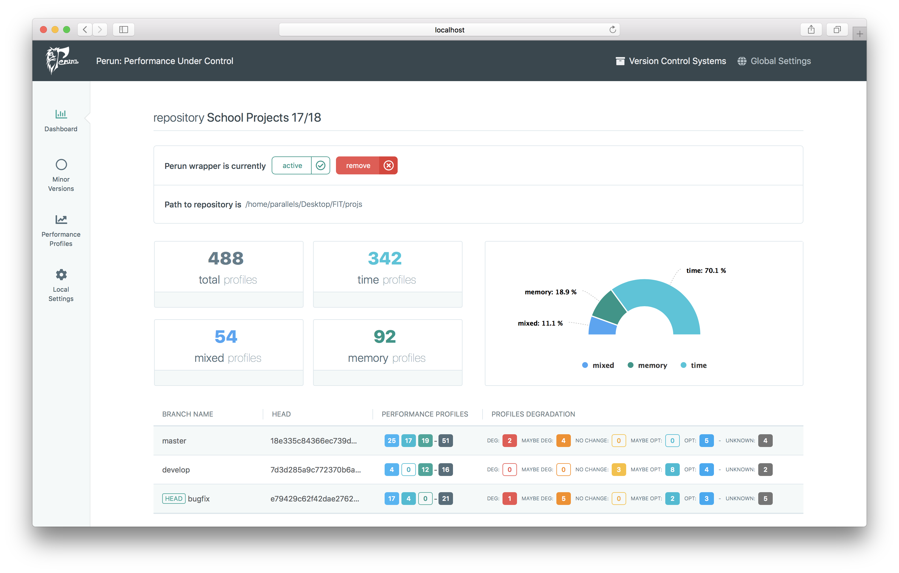

Graphical User Interface for Perun: Lightweight Performance Version System
=============================================

<p align="center">
  
</p>

Graphical User Interface for Perun <https://github.com/tfiedor/perun> designed and implemented as a part of my bachelor thesis.

#### Abstract
One of the most frequent ways to test system performance is the program profiling technique, which carries out a~collection of resource consumption data and its subsequent evaluation leading to the detection of performance changes, whose existence may have a~negative impact on the system in development. For the realization of the profiling process and more complex application performance management, there are several established solutions. Perun belongs among the newer performance managers, it provides automatization of creating as well as managing of the performance profiles. However, the current version only offers a~console user interface, therefore it is not suitable for deployment to e.g. cloud. The main objective of this thesis is to specify, design and implement a~graphical user interface for Perun. The resulting interface targets the core functionality such as profiling data collection based on the pre-defined configuration, its subsequent postprocessing or effective visualization, as well as the ability to clearly give information about the status of performance degradation among individual project versions. The solution is demonstrated on three non-trivial version control systems annotated by performance profiles.

Installation
------------
Perun installation is described at its official repository found at <https://github.com/tfiedor/perun>. The GUI can be launched without a Perun installation in the system, however, no performance profile stats will be displayed.

``` bash
# install dependencies (currently Flask only)
$ make install

# runs the Flask server at http://10.211.55.7:5000/
$ make run
```

Development mode
------------
To run Vue.js files in development use Webpack.
``` bash
# install Webpack
$ npm install --save-dev webpack

# run in development mode
$ npm run dev

# build files
$ sudo npm run build
```